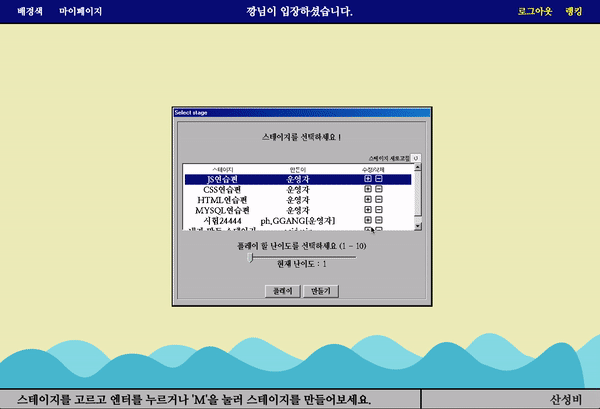

# :umbrella: 개발자를 위한 산성비 게임 :umbrella:
</br>

코딩을 시작하는 우리에게는 타이핑마저 어렵다!
</br>

**추억의 타자연습 산성비 게임이 개발자를 위한 타이핑 연습 게임으로 재탄생했습니다.**

</br>

> CSS에서 어떤 property들이 있었는지 기억이 나지 않아 하나 하나 구글링하고 계신가요? </br>
> Javascript 코드를 영화 속 해커처럼 빠르고 멋지게 치고 싶나요? </br>
> 습관적인 사소한 오타로 인해 발생하는 버그들에 지쳐버리셨나요?

</br>
산성비 게임을 하다보면 낯설기만 했던 코드에 어느새 익숙해져있는 당신을 발견할거예요!

</br>

## :round_pushpin: Demo

</br>



</br>

내려오는 코드들을 빠르고 정확하게 입력해보세요!

</br>

## :wave: Getting started

</br>

본 프로젝트에는 package.json이 client와 server 각 따로 존재합니다.

> 터미널을 두개 킨 후 하나는 client폴더, 하나는 server 폴더로 이동해서 두 폴더 모두에서 다음과 같은 명령어를 입력합니다.

</br>


## :wrench: Install

</br>

```
npm install
```

</br>

## :satellite: Usage 

</br>

```
npm start
```

</br>

## :computer: Server Set up

</br>

NOTE: 이 server는 5000 포트에서 작동합니다. </br>

* http://localhost:5000

</br>

## :earth_asia: Accessing the service

</br>

브라우저를 열어 (크롬을 권장합니다) 주소창에 다음 내용을 입력하세요. </br>

* http://localhost:3000

</br>

## :gem: Deploy

</br>

Repository 다운로드 없이 다음 링크에서 바로 플레이할 수 있습니다.  </br>
* http://acidrain.s3-website.ap-northeast-2.amazonaws.com/

</br>

## :notebook: Used Stack
</br>


Client - react, google api</br>
Server - express, mysql, sequelize, session-cookie, node</br>
Deploy - S3, EC2, RDS
</br>

## :busts_in_silhouette: Author

</br>
Front-end : 김나연 / 이건민</br>
Back-end : 권오연 / 박찬울
</br>
</br>

## :pencil: License

</br>

MIT © 2020 Acid-rain/codestates

</br></br>

